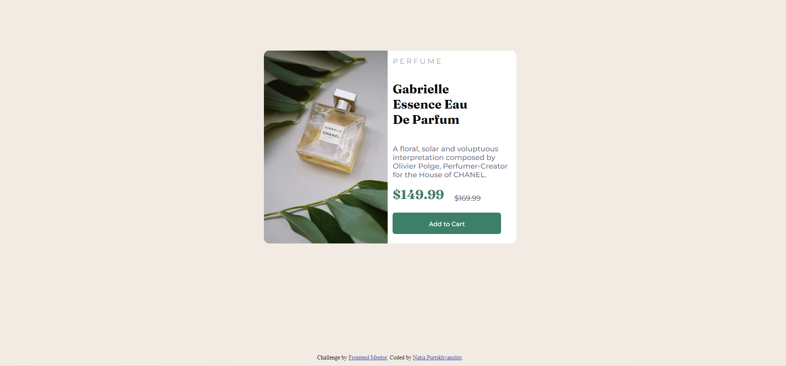

# Frontend Mentor - Product preview card component solution

This is a solution to the [Product preview card component challenge on Frontend Mentor](https://www.frontendmentor.io/challenges/product-preview-card-component-GO7UmttRfa). Frontend Mentor challenges help you improve your coding skills by building realistic projects. 

## Table of contents

  - [The challenge](#the-challenge)
  - [Screenshot](#screenshot)
  - [Links](#links)
  - [Built with](#built-with)
  - [What I learned](#what-i-learned)
  - [Author](#author)

### The challenge

Users should be able to:

- View the optimal layout depending on their device's screen size
- See hover and focus states for interactive elements

### Screenshot

### Links

- Solution URL: (https://github.com/natia-purtskhvanidze/product-preview-card-component-main)
- Live Site URL: (https://natia-purtskhvanidze.github.io/product-preview-card-component-main/)

### Built with

- Semantic HTML5 markup
- CSS custom properties
- Flexbox

### What I learned

I learned to build a simple responsive page from scratch. This is my first solo project and despite the fact that
it is not ideally written, I am very proud of it and I continue learning. I hope I will come back to this challenge
and be able to optimize the code easily.

## Author

- Github - [Natia Purtskhvanidze](https://github.com/natia-purtskhvanidze)
- Frontend Mentor - [@natushkiss](https://www.frontendmentor.io/profile/natushkiss)
- Linkedin - [Natia Purtskhvanidze](https://www.linkedin.com/in/natia-purtskhvanidze/)
